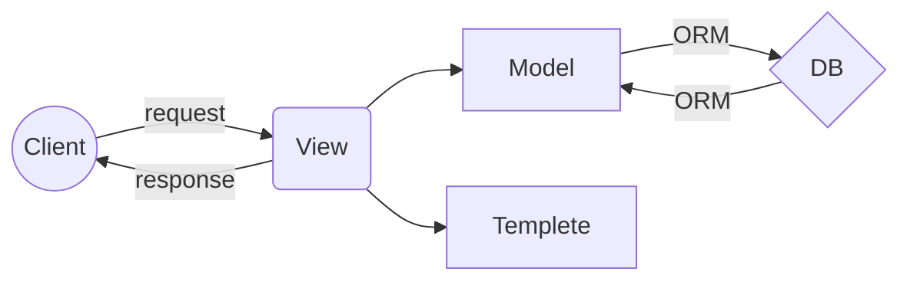

# TEMPLATE

**※참고** 

1. [장고 공식문서 - template](https://docs.djangoproject.com/en/2.1/topics/templates/) 
3. [Che1's Blog - 템플릿](https://nachwon.github.io/django-8-template/)
4. [Che1's Blog - 템플릿 언어](https://nachwon.github.io/django-10-temp-language/)
5. [초보몽키 - 정적파일, 템플릿 확장](https://wayhome25.github.io/django/2017/03/12/django-06-poll-project-16-static-extends/)
6. [장고걸스 -  템플릿 확장](https://tutorial.djangogirls.org/ko/template_extending/)
7. Two scoops of django (p~ p)
8. [HTML, CSS 관련 참고 자료](#html-css)

<br><br><br><br><br><br><br><br><br><br>


## 0. Intro
> **오늘 우리는..**
>1. 템플릿이 무엇인지 
>2. 템플릿이 어떻게 동작하는지
>
>

<br><br><br><br><br><br><br><br>

## 1. 템플릿, 무엇?

장고 공식 문서에 따르면,  
"템플릿은 Django가 html을 동적으로 제어하는 편리한 방법" 이라고 합니다.  

그렇다면 html은 무엇인지, 또 이를 동적으로 제어한다는 건 어떤 의미인지 하나하나 살펴도록 하겠습니다.  

<br><br><br>

### - HTML 
HTML은 우리가 접하는 웹페이지를 구성하는 대표적인 언어입니다.  
그렇지만 대부분의 사이트들은 순수한 html 말고도 이것저것 많이 섞여있는 상태이긴 해요.  
html의 본질을 이해하기 위해서 잠시 그 '이것저것'을 잠시 걷어내볼게요.  
<br>
<a href="https://ibb.co/xLKLHS4"></a><br>
<br>
이것이 순수한 HTML로 이루어진 네이버 사이트의 모습입니다.  
무엇이 보이죠?  
정보의 연속입니다.  
"네이버", "네이버를 시작페이지로" 등등의 내용들이 줄줄이 쓰여져 있죠.  

html은 `<태그로> 이러한 정보들을 </감싸서>`,  
해당 정보가 이 웹페이지의 **구조**에서 어느 부분을 담당하는지 분명히 합니다.   
나아가 이 정보에게 어떠한 **역할, 기능**을 부여하기도 해요.  

<br><br><br>

알기 쉽게  예시를 들어 살펴보도록 하겠습니다!!  

웹페이지를 하나 가정해봅시다.  
학생식당의 오늘 식단 정보를 알려주는 웹페이지가 있다고 생각해보는 겁니다.  

이 웹페이지에는 어떤 정보가 들어가야할까요?  
'오늘의 식단'이라는 **제목**, 3/28이라는 날짜를 표시해주는 **단락**, 메뉴를 표시해주는 **목록**..  정리해보면 다음과 같습니다.  

```
오늘의 식단
3/28

- 메뉴A : ~~~~
- 메뉴B : ~~~~
- 메뉴C : ~~~~
```

위의 정보들을 html 태그로 구조화하려면 어떻게 해야 될까요?  

"오늘의 식단"이라는 제목 정보는 `<h1>`이라는 태그로,  
"3/28"이라는 단락 정보는 `<p>`라는 태그로,   
식단 목록 전체는 `<ul>`이라는 태그로,  
식단 항목 하나하나는 `<li>`라는 태그로 표시할 수 있습니다.  

<br>

--------------------

<br>

**실습을 통해 알아봅시다!**  

우선 index.html이라는 파일을 만듭시다..  
(코드에디터도 좋고, 없다면 메모장도 괜찮아요)  
<br><br>

html은 기본적으로 정보를 태그로 감싸서 구조화하는 언어라고 했지요.  
우리가 첫번째로 전달해줄 구조에 대한 지시는, **이 모든 코드는 html이다** 라는 것입니다.  
우리는 앞으로 작성할 모든 코드를 이 `<html>` 태그 안에 작성하도록 할 거에요.  

```html
<html>
</html>
```
<br><br>

html은 기본적으로 **head**와 **body**로 나뉘어있습니다.  
`<head>`에 들어가는 내용은 위쪽, 제목이 표시되는 부분이고, `<body>`에 들어가는 내용은 우리가 보는 창에 들어갈 실제 내용이에요. 나눠볼까요?  

```html
<html>
	<head>
	</head>
	<body>
	</body>
</html>
```

<br><br>

일단 head는 비워두고, body에 내용을 작성하도록 할게요.  
**제목**부터 넣어봅시다.  
제목을 표시하는 태그는 heading의 h를 따온 `<h>` 태그인데, 중요도에 따라서 `<h1>`부터 `<h2>`,`<h3>`, `<h4>`  등등이 있어요.  
사이트의 제목은 가장 중요도가 높고 크게 보여져야하는 정보니까, `<h1>` 태그로 감싸서 '이 친구는 1순위로 중요한 제목이야!'라고 알려줍시다.  

```html
<html>
	<head>
	</head>
	<body>
		<h1>오늘의 식단</h1>
	</body>
</html>
```

<br><br>

그 다음, **날짜**를 작성해볼게요.  
날짜는 제목 급은 아니지만.. 그 날을 대표하는 중요한 정보니까 `<h2>` 정도로 쓸까요?  

```html
<html>
	<head>
	</head>
	<body>
		<h1>오늘의 식단</h1>
		<h2>3/28</h2>
	</body>
</html>
```

<br><br>

그리고 식단 정보를 넣습니다.  
학식은 세 가지 메뉴를 제공하니까, 메뉴A, 메뉴B, 메뉴C 이 세 가지 메뉴를 **목록**으로 묶어서 한번에 표시하도록 합시다.  
이곳에 정보가 **목록**이라고 알려주는 태그는 `<ul>`이에요.  
<i>(`<ul>`은 unordered list라는 뜻으로, 순서가 중요하지 않은 리스트를 뜻해요.  
만약 순서 표시가 중요한 리스트라면,  ordered list, 즉 `<ol>`이라는 태그를사용하면 돼요)</i>  

```html
<html>
	<head>
	</head>
	<body>
		<h1>오늘의 식단</h1>
		<h2>3/28</h2>
		<ul>

		</ul>
	</body>
</html>
```

<br>

그 다음, 목록 안에 있는 **각 항목**을 적어줍니다.  
목록의 **항목**은 `<li>` 태그로 표시해요.  

```html
<html>
	<head>
	</head>
	<body>
		<h1>오늘의 식단</h1>
		<h2>3/28</h2>
		<ul>
			<li>특식| 뚝배기소고기된장찌개, 메밀전병, 부추잡채, 포기김치</li>
			<li>특식| 무교동식낙지비빔밥, 계란후라이, 북어채김치국, 부추잡채, 포기김치, 부추잡채, 포기김치</li>
			<li>양식| 수원왕갈비순살치킨, 양배추샐러드, 추가밥, 북어채 김치국, 부추잡채, 포기김치</li>
		</ul>
	</body>
</html>
```

<br><br>

정말정말 마지막으로...  
리스트 안의 내용들을 **단락**으로 나누고 싶다는 생각이 들지 않나요?  
특식, 양식과 같은 메뉴의 **카테고리 분류**와 **메뉴 내용**은 다르잖아요.  
또, 각각의 메뉴들이 가로로 긴 일렬로 있는 것보다는, 항목마다 줄바꿈이 되면 보기 좋겠죠.  
단락을 나타내는 태그는 `<p>`입니다. 줄바꿈을 해주는 태그는 `<br>` 이에요.  

```html
<html>
	<head>
	</head>
	<body>
		<h1>오늘의 식단</h1>
		<h2>3/28</h2>
		<ul>
			<li>
				<p>특식|</p>
				<p>뚝배기소고기된장찌개<br>메밀전병<br>부추잡채<br>포기김치</p>
			</li>
			<li>
				<p>특식|</p>
				<p>무교동식낙지비빔밥<br>계란후라이<br>북어채김치국<br>부추잡채<br>포기김치<br>부추잡채<br>포기김치<p>
			</li>
			<li>
				<p>양식|</p>
				<p>수원왕갈비순살치킨, 양배추샐러드, 추가밥, 북어채 김치국, 부추잡채, 포기김치</p>
			</li>
		</ul>
	</body>
</html>
```

<br><br><br>

이렇게 완성된 우리의 html 파일을 브라우저에서 열어볼까요?  
<br>
<a href="https://ibb.co/vxdrwsF"></a>
<br>
와! 정말 간단하고 별거없고 못생겼지만, 아무튼 완성했어요.  
각각의 정보가 알맞게 위치하고 있어요!  
<br>
<br>
<br>

그렇지만 조금 더 구조적으로 깔끔하게 다듬어볼게요.  
**[오늘의 식단]** 부분을 `제목 구역`으로,** [그 밑의 모든 부분]**을 ``내용 구역`으로 나눠주면 더 관리하기 좋아질 것 같아요.  

빠르게 앞의 태그들을 복습하자면, `<h1>`은 제목을 의미하고 `<p>`는 단락을 의미하고 `<ul>`은 리스트를 의미합니다.   
그렇지만 아무 의미 없이 그냥 **구역을 나눠놓고 싶을 때**는, 아무 의미없는 태그 `<div>`를 씁니다.  
```html
<html>
	<head>
	</head>
	<body>
		<div>
			<h1>오늘의 식단</h1>
		</div>
		<div>
			<h2>3/28</h2>
			<ul>
				<li>
					<p>특식|</p>
					<p>뚝배기소고기된장찌개<br>메밀전병<br>부추잡채<br>포기김치</p>
				</li>
				<li>
					<p>특식|</p>
					<p>무교동식낙지비빔밥<br>계란후라이<br>북어채김치국<br>부추잡채<br>포기김치<br>부추잡채<br>포기김치<p>
				</li>
				<li>
					<p>양식|</p>
					<p>수원왕갈비순살치킨, 양배추샐러드, 추가밥, 북어채 김치국, 부추잡채, 포기김치</p>
				</li>
			</ul>
		</div>
	</body>
</html>
```
좀 더 보기 좋아졌죠.  

폴더를 만든다고 생각하면 좋을 거 같아요.  
이 디렉토리의 하위 디렉토리, 또 그 하위 디렉터리.. 로 가면서 보기 쉽게 수납해놓는 느낌?  

<br><br>
이렇게 나눠놓는 것은 단순히 코드 편집할 때 깔끔하게 정리하려는 용도가 아니에요.  
나중에 나눠놓은대로 접근하여 각각의 영역을 관리하기 위함이에요.  
이를 위해서 영역별로 **특별한 이름**을 지어줘야 해요.  

이 때는 `class`라는 속성을 사용하면 됩니다. `<div>`의 class 값에 내가 알아볼 수 있는 이름을 지어주세요!  

```html
<html>
	<head>
	</head>
	<body>
		<div class="heading">
			<h1>오늘의 식단</h1>
		</div>
		<div class="contents">
			<h2>3/28</h2>
			<ul>
				<li>
					<p>특식|</p>
					<p>뚝배기소고기된장찌개<br>메밀전병<br>부추잡채<br>포기김치</[>
				</li>
				<li>
					<p>특식|</p>
					<p>무교동식낙지비빔밥<br>계란후라이<br>북어채김치국<br>부추잡채<br>포기김치<br>부추잡채<br>포기김치<p>
				</li>
				<li>
					<p>양식|</p>
					<p>수원왕갈비순살치킨, 양배추샐러드, 추가밥, 북어채 김치국, 부추잡채, 포기김치</p>
				</li>
			</ul>
		</div>
	</body>
</html>
```
<br><br>

---------------------------------

<br><br>

얘기가 길었지만 핵심은 다음과 같습니다.  
<br><br>
>**핵심요약** 
> html은 정보를 구조화한다.
> 웹페이지라는 건물의 '뼈대'와 같은 역할
<a id="html-css"></a>
<br><br>

이제 여기서 더 나아가면,   
CSS라는 언어를 통해 레이아웃을 구성하고 예쁘게 꾸미고,   
Javascript라는 언어를 통해서 사용자와 상호작용하며 실제 웹페이지가 동작하게 만드는 건데....  

우리는 지금 웹 프론트엔드 쪽을 다루는 건 아니니까 그냥 그런 역할을 하는 얘네가 있다- 정도로만   알고 넘어갑시다.  
이쪽으로 더 알아보고 싶다면 참고할만한 링크를 드릴게요!  
<br><br>

- [codecadmy](https://www.codecademy.com/learn) | 예제를 통한 html&css 학습
- [css dinner ](https://flukeout.github.io/)| 게임으로 익히는 css 선택자
- [codepen ](https://codepen.io/)| html & css & js 프로젝트 참고

<br><br>
(시간만 괜찮다면 css도 살펴봅시다! 아니면 그냥 복붙해도 되고...)  
<br><br>

```css
body {
    width: 100vw;
    height: 100vh;
    overflow: hidden;
    
    padding: 0;
    margin: 0;
    
    background-color: #e5a53f;
}

.header{
    margin-top: 10vh;
    margin-bottom: 10vh;
    padding-left: 20vw;
    font-family: "((원하는 폰트 이름))";
    color: #ffffff;
    
}

.header h1 {
    margin: 0;
    font-size: 15vh;
}


.contents {
    text-align: center;
    color: #fad69e;
    
}


.contents h2 {
    margin: 0;
    margin-bottom: 5vh;
    font-size: 8vh;
    font-family: "((원하는 폰트 이름))";
}


.category {
    margin: 0;
    font-size: 4vh;
}


li {
    display: inline-block;
    
    text-align: left;
    vertical-align: middle;
    
    width: 20%;
    height: 20%;


​    
    padding-left: 5vh;
    
    font-family: "((원하는 폰트 이름))";
    font-size: 3vh;
}
```


<br><br><br>


### - 동적으로 제어

자, 이제 HTML이 무엇인지에 대해서는 대충 이해했어요.  
앞에 설명 다 기억이 안나도 하나만 기억하세요.   
HTML은 뼈대입니다. **<태그로> 정보 </의 앞뒤를 싸서>**,  
"이 아이는 여기 담당이야, 이 기능을 수행해" 라고 표시해주는 거에요.  

그렇다면 이러한 HTML을 **동적으로 제어한다**는 것은 무슨 말일까요?  

HTML은 정적인 언어입니다. 내용 자체를 바꾸지 않는 한, 외부 접근을 통해 정보나 구조에 변화를 줄 수 없어요.  
그렇지만 우리는 어떤 경우에는... 얘가 좀 알아서 내용을 눈치껏 바꿔줬으면 싶을 때가 있습니다.  
멀리갈 것도 없이 아까 실습 때 작성한 우리 예시를 보세요.  
<br>
<a href="https://ibb.co/vxdrwsF"></a>
<br>
3월 28일의 식단이에요.  
그럼 3월 29일이 되면 어떻게 해야할까요?  
다시 html 파일에 들어가서, 날짜 위치에 있는 정보를 3/29로 바꾸고,  
각 식단을 전부 다 하나하나 타이핑해넣어야해요...  

어차피 정보를 업데이트하려면 이런 작업은 어떤 형태로든 해야되는 거 아닌가? 싶기도 해요.  
하지만 사이트가 훨씬 더 커진다고 생각해보세요.  
<br>
<a href="https://ibb.co/LPGXnn7"></a>
<br>
이렇게나 많은 코드 중에서 내가 업데이트할 정보의 위치를 찾고, 수정하고, 다시 업로드하고...  
정말 복잡하고 성가신 일이죠!! 그러다가 실수해서 다른 중요한 태그를 건드리거나 '>' 기호 하나를 지웠다면? 페이지는 완전히 망가져있는데 어디에서 잘못됐는지 찾기도 힘들어요.  

HTML은 뼈대만 잡고 더 이상 건드리지 않은 채로 내버려두는 게 정신 건강에 이로워요.  
정보 관리는 DB 쪽에서 작업하는 것으로 끝내는 게 깔끔하죠.  
그렇기에 우리는 HTML을 **동적으로 관리할 필요성**을 느끼는 겁니다.  

우리가 아까 만든 html 파일에서 **동적으로 제어하고 싶은 부분**은 무엇이죠?  
매일 바뀌는 **날짜**와 **메뉴** 부분이죠......  
그냥 텍스트로 이루어진 이 정보를, 직접 타이핑해서 수정하지 않고는 바뀌질 않는 이 부분을 **템플릿 언어**, 즉 DTL(Django Template Language)이나 Jinja를 통해 작성하는 거에요.  

```html
<html>
    <head>
        <meta charset="utf-8">
        <title>오늘의 식단</title>
        <link rel="stylesheet" type="text/css" href="">
    </head>
    <body>
       <div class="header">
            <h2>MENU TODAY</h2>
            <h1>오늘의 식단</h1> 
       </div>
        <div class="contents">
                <p class="date"> - - - - 템플릿언어(오늘날짜) - - - - </p>
                <ul>
                    <li><p class="category">특식 |</p> <p>- - - 템플릿언어(오늘메뉴1) - - -</p> </li>
                    <li><p class="category">특식 |</p> <p>- - - 템플릿언어(오늘메뉴2) - - -</p></li>
                    <li><p class="category">양식 |</p> <p>- - - 템플릿언어(오늘메뉴3) - - -</p></li>
                </ul>
        </div>
    </body>
</html>
```
**오늘 날짜를 가져오는** 템플릿 언어, **오늘 메뉴를 가져오는** 템플릿 언어가 위에 표시된 위치에 들어가야할 거에요.  

정확히 어떤 문법을 사용해야하는지는 오늘은 설명하지 않을게요. 저 위치에 html과는 다른, django가 다루는 새로운 언어가 들어가야한다! 정도로만 알고 있으면 될 것 같아요.  

<br><br><br>


정리해볼까요?   
템플릿 파일은 다음과 같은 두 가지 부분으로 구성되어 있습니다.  

> **템플릿** 
>
> - **HTML (정적 뼈대)**
> - **템플릿 언어 (동적으로 정보 표시)**


<br><br><br>


여기서... 다음 시간에 배울 내용을 간단하게 스포를 하자면...  

기존 날짜와 메뉴를 바꿔치기 하는 게 아니라, 블로그 포스팅 목록처럼 다음날이 되면 3/29의 식단이 3/28의 식단 위쪽에 표시되고, 그 다음날에는 그 위쪽에 3/30의 식단이 계속계속 누적되어서 스크롤하여 모든 정보를 확인할 수 있는 식으로 구현할 수도 있고요.  
` `.... 아마?  )

학생식당의 식단 뿐만 아니라 교직원 식당, 푸드코트, 창업보육센터 등 같은 포맷이지만 전혀 다른 정보들을 간단하게 표시하고 싶을 때, 지금 만든 **식단 페이지의 기본 구조**를 상속받아... **확장**하여 쓸 수도 있답니다.   
(``... 사실 저 정확한 문법 공부는 거의 안했어요...ㅎ.......)  

다음 시간을 기대해주세요!!  

<br><br><br><br><br><br><br><br><br><br>


## 2. 템플릿, 어떻게 동작?
>
>**핵심요약** 


큰그림 시간에 배웠던 거 기억나죠...  
이 얘기 또 할 거에요! 신나는 복습시간~~~~  

<br><br><br>

### - Model
```python
from django.db import models

# Create your models here.
class  Menu(models.Model):
	date = models.CharField(max_length  =  10)
	menu1 = models.CharField(max_length  =  70)
	menu2 = models.CharField(max_length  =  70)
	menu3 = models.CharField(max_length  =  70)

	created_date = models.DateTimeField(auto_now_add=True)
	published_date = models.DateTimeField(auto_now=True)

	def  __str__(self):
		return  self.date
```
식단을 나타내는 모델을 구현했어요.  
식단 모델에는 날짜 정보와 각각의 메뉴 세 개에 대한 정보가 들어가요.  

우리가 지난번에 했던 것처럼 `/admin`으로 들어가서 데이터를 추가하면,  
입력한대로! `date`와 `menu1`, `menu2`, `menu3`를 갖는 하나의 Menu 객체가 생성되어 DB에 보관되는 거에요.  

<br><br><br>
### - View
```python
from django.shortcuts import render
from .models import Menu

# Create your views here.
def  menu_list(request):
	menu = Menu.objects.all()
	context = {'menu' : menu}
	return render(request, "menulist/index.html", context)
```
이렇게 만들어진 모델을 `from .models import Menu` 이 부분을 통해 view에서 모델에 접근할 수 있게 해줍니다.  

이제 이 모델들을 어떻게 불러오느냐 --- 에 대한 부분은 아마 다다다음 시간?에 자세하게 배울텐데요. **ORM**을 통해서 가져온다고 하네요.  


```python
menu = Menu.objects.all()
```
이 부분이 ORM이래요.  
생성되어있는 모든 Menu 오브젝트를 가져와서, `menu`라는 변수에 담는 작업인 거에요.  

```python
**`context = {'menu' : menu}`** 
```

아무튼, 이렇게 `menu`라는 변수 안에 데이터를 가진 객체를 담은 뒤,   
이를 `context`라는 **딕셔너리**에 넣습니다.  
 'menu'라는 Key 값에 Menu 오브젝트를 담은 변수 `menu`를 Value로 넣어주는거에요.  

여기까지, 템플릿에 데이터를 전달하기 위한 기본 준비가 다 끝났습니다.  
우리는 이 `context`를 템플릿에 전달해줄 거에요.  
그럼 템플릿 안에서, `context`의 Key 값을 만나면 해당되는 Value로 처리함으로써, 정보를 동적으로 처리할 수 있게 돼요.  

즉, 우리가 만든 템플릿 파일 내에서 `context`에 등재된 키워드인 `menu`라는 {{변수}}를 만나면, 그 부분을 "date, menu1, menu2, menu3을 갖고 있는 Menu 오브젝트"로 생각하게 되는 거에요.  
이 부분은 다음 시간에... 직접 문법을 만지면서 실습하면서 배우면 이해가 빠를 거에요.  


```python
return render(request, "menulist/index.html", context)`
```

그럼 템플릿에 어떻게 전달하느냐. `render`함수를 이용합니다.  
첫번째 인자는 사용자의 `request`입니다. 두번째 인자로는 해당 요청에 어떤 페이지를 보여줄지, 해당하는 템플릿 파일의 위치를 넣어주면 돼요.   

그리고 세번째 인자가 바로 위에서 만들었던 딕셔너리, `context`입니다.  
우리가 만든 템플릿 파일은 순수 HTML이 아니에요.  
웹브라우저가 알아들을 수 없는, 장고 템플릿 언어 DTL 문법으로 작성된 부분이 있거든요.  

`render`함수는, 전달된 `context`에 따라서, 딕셔너리인 `context`의 Key 값에 해당하는 {{변수}}를 찾은 다음 그에 대응되는 Value인 객체로 바꿔줘요.   
또 ``와 같은 템플릿 언어의 문법을 다 HTML로 변환하는 처리를 거친 뒤, 완성된 순수 HTML파일을 return 해줍니다.  

즉 템플릿언어를 렌더링해서 HTML로 바꾼 뒤 돌려주는 함수라고 이해하시면 됩니다.  

<br><br><br>

### - Template
```html


<html>
    <head>
        <meta charset="utf-8">
        <title>오늘의 식단</title>
        <link rel="stylesheet" type="text/css" href="">
    </head>
    <body>
       <div class="header">
            <h2>MENU TODAY</h2>
            <h1>오늘의 식단</h1> 
       </div>
        <div class="contents">
                <p class="date">3/28</p>
                <ul>
                    <li><p class="category">특식 |</p> <p>뚝배기소고기된장찌개<br>메밀전병<br>부추잡채<br>포기김치</p></li>
                    <li><p class="category">특식 |</p> <p>무교동식낙지비빔밥<br>계란후라이<br>북어채김치국<br>부추잡채<br>포기김치</p></li>
                    <li><p class="category">양식 |</p> <p>수원왕갈비순살치킨<br>양배추샐러드<br>추가밥<br>북어채감치국<br>부추잡채<br>포기김치</p></li>
                </ul>
        </div>
    </body>
</html>
```
우리가 앞에서 DTL이나 Jinja 문법을 다루었다면...  
이 대목에서 어떤 부분이 어떻게 바뀌는지에 대해 하나하나 설명했겠지만 안타깝게도 전부 순수 HTML이네요! (CSS 추가 부분 제외)  

그냥 저 뚝배기 소고기 된장찌개 부분이나 3/28 같은 부분이 굉장히 안 익숙한 새로운 DTL 혹은 Jinja 언어로 쓰여져 있고,  
이 부분을 render 함수가 알아서 바꾸고 context에 있는대로 변수를 슉슉 넣어준다!라는 대강의 느낌만 이해하고 갑시다!  

오늘은 맛보기로, Django의 템플릿 파일에 CSS를 추가하는 작업까지만 해봅시다.  
Django에서는 CSS를 추가하는 방식이 순수 html과는 다릅니다.  
장고에서 CSS는 `static 파일`이에요. 그래서,  

```
 djangoproject
    ├── myapp
    │   ├── migrations
    │   ├── static           ( >>  /myapp/style.css )
    │   └── templates        ( >>  /myapp/index.html )
    └── mysite
```
여기 `static` 아래의 `앱 이름` 폴더의 하위 항목으로 `style.css`를 넣어주어야 해요. 그래야 장고가 알아서 이 파일을 찾아올 수 있어요.  

어떻게 찾아오냐면.......우리가 항상 프로젝트 새로 만들 때마다 `settings.py` 수정하잖아요..  

```python
STATIC_ROOT = os.path.join(BASE_DIR, 'statc')
```

이 코드 기억나나요?  
이 부분의 의미가 바로, "나는 `static 파일`을 저장할 때 여기서 할거다!" 라고 미리 설정해두는 거에요.  

아무튼 이렇게 만들어놓은 static 폴더 안에 앱이름으로  css파일을 위치시켜주고, 콘솔에서  
```
> python manage.py collectstatic
```
명령을 실행해주면 `static` 폴더 안에 있는 파일들이 모아집니다.  

그리고 저 위에 html 보시면, 우리가 아까 만들었던 거랑은 조금 다르게 맨 위에  
``이라고 적혀있죠.. static이라는 명령어를 가져오는 거래요 다음시간에 자세히 배워봅시다.  

그리고 원래 순수 html에서 css 파일의 위치를 입력하는 `href = ""` 의 위치에 ``라는 템플릿 언어를 써주면 장고 프로젝트 내에서 CSS 연결이 성공되었습니다!   
CSS가 적용되니까 훨씬... 보기 좋죠.... 마음이 편안해져요..........  


<br><br><br>
### - URL
```python
from django.contrib import admin
from django.urls import path, include

urlpatterns = [
	path('admin/', admin.site.urls),
	path('', include('myapp.urls'))
]
```
**△프로젝트의 `urls.py`**

```python
from django.urls import path
from . import views

urlpatterns = [
	path('', views.menu_list, name='menu_list'),
]
```
**△앱 내부의 `urls.py`**

그렇게 해서 완성된 `views.py`의 menu_list 함수가 여기에서 쓰입니다.  
path의 첫번째 인자는 요청받은 url을 의미하고, 두번째 인자는 그 때 보여줄 html을 의미합니다.  
드디어 식단 목록을 보여주는 html이 브라우저에 보여지는 것이지요.  

이렇게 전체 흐름에 대한 대한 복습이 끝났습니다!  
<br>

-----------------------------------
<br>

**실습해볼까요..?**  
